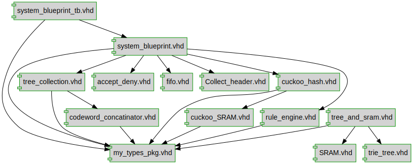

# Layer4-Firewall

# Setup
To run the program, it requries python 3.10 or newer and the requried packages. They can be installed with pip
```bash
pip install pyvis
pip install networkx
pip install matplotlib
```
# How to run
Go to test_ruleile.py in the test directory. Add go to the function test_RulelistManuelTest.py and change the rulelist = [] list to your desired rule set. You can also add packets in the same by adding to the packetList=[]. This will output to the file tree_data_tb.txt, and cuckoo_sram_data.txt. Now you can simulate it in modelsim with the top level being system_blueprint_tb.vhd

# Documentation for Firewall


## Designs

- Package: [my_types_pkg ](./doc_internal/my_types_pkg.md)
- Module: [codeword_concatinator ](./doc_internal/codeword_concatinator.md)
- Module: [SRAM ](./doc_internal/SRAM.md)
- Module: [tree_and_sram ](./doc_internal/tree_and_sram.md)
- Module: [tree_collection ](./doc_internal/tree_collection.md)
- Module: [trie_tree_logic ](./doc_internal/trie_tree.md)
- Module: [system_blueprint ](./doc_internal/system_blueprint.md)
- Module: [Accept_Deny ](./doc_internal/accept_deny.md)
- Module: [packet_fifo ](./doc_internal/fifo.md)
- Module: [Collect_header ](./doc_internal/Collect_header.md)
- Module: [Cuckoo_Hashing ](./doc_internal/cuckoo_hash.md)
- Module: [cuckoo_SRAM ](./doc_internal/cuckoo_SRAM.md)
- Module: [rule_engine ](./doc_internal/rule_engine.md)

