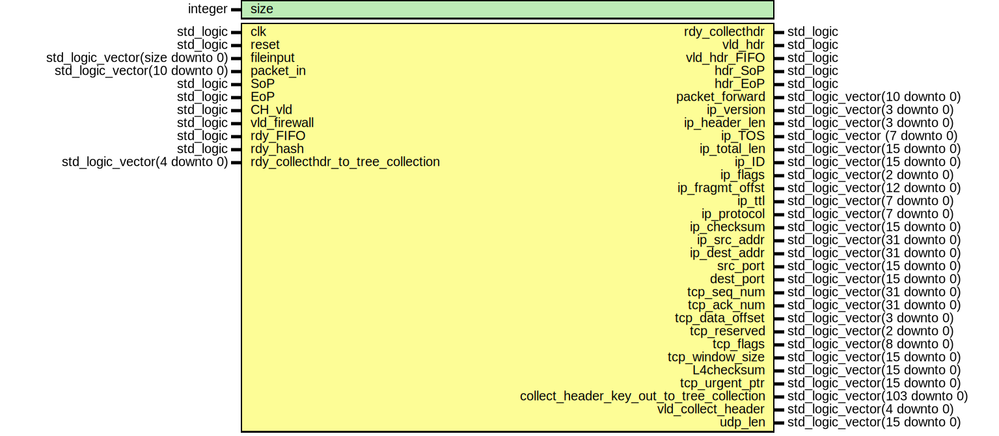

# Entity: Collect_header 

- **File**: Collect_header.vhd
## Diagram

## Generics

| Generic name | Type    | Value | Description |
| ------------ | ------- | ----- | ----------- |
| size         | integer | 10000 |             |
## Ports

| Port name                                 | Direction | Type                            | Description |
| ----------------------------------------- | --------- | ------------------------------- | ----------- |
| clk                                       | in        | std_logic                       |             |
| reset                                     | in        | std_logic                       |             |
| fileinput                                 | in        | std_logic_vector(size downto 0) |             |
| packet_in                                 | in        | std_logic_vector(10 downto 0)   |             |
| SoP                                       | in        | std_logic                       |             |
| EoP                                       | in        | std_logic                       |             |
| CH_vld                                    | in        | std_logic                       |             |
| vld_firewall                              | in        | std_logic                       |             |
| rdy_FIFO                                  | in        | std_logic                       |             |
| rdy_hash                                  | in        | std_logic                       |             |
| rdy_collecthdr                            | out       | std_logic                       |             |
| vld_hdr                                   | out       | std_logic                       |             |
| vld_hdr_FIFO                              | out       | std_logic                       |             |
| hdr_SoP                                   | out       | std_logic                       |             |
| hdr_EoP                                   | out       | std_logic                       |             |
| packet_forward                            | out       | std_logic_vector(10 downto 0)   |             |
| ip_version                                | out       | std_logic_vector(3 downto 0)    |             |
| ip_header_len                             | out       | std_logic_vector(3 downto 0)    |             |
| ip_TOS                                    | out       | std_logic_vector (7 downto 0)   |             |
| ip_total_len                              | out       | std_logic_vector(15 downto 0)   |             |
| ip_ID                                     | out       | std_logic_vector(15 downto 0)   |             |
| ip_flags                                  | out       | std_logic_vector(2 downto 0)    |             |
| ip_fragmt_offst                           | out       | std_logic_vector(12 downto 0)   |             |
| ip_ttl                                    | out       | std_logic_vector(7 downto 0)    |             |
| ip_protocol                               | out       | std_logic_vector(7 downto 0)    |             |
| ip_checksum                               | out       | std_logic_vector(15 downto 0)   |             |
| ip_src_addr                               | out       | std_logic_vector(31 downto 0)   |             |
| ip_dest_addr                              | out       | std_logic_vector(31 downto 0)   |             |
| src_port                                  | out       | std_logic_vector(15 downto 0)   |             |
| dest_port                                 | out       | std_logic_vector(15 downto 0)   |             |
| tcp_seq_num                               | out       | std_logic_vector(31 downto 0)   |             |
| tcp_ack_num                               | out       | std_logic_vector(31 downto 0)   |             |
| tcp_data_offset                           | out       | std_logic_vector(3 downto 0)    |             |
| tcp_reserved                              | out       | std_logic_vector(2 downto 0)    |             |
| tcp_flags                                 | out       | std_logic_vector(8 downto 0)    |             |
| tcp_window_size                           | out       | std_logic_vector(15 downto 0)   |             |
| L4checksum                                | out       | std_logic_vector(15 downto 0)   |             |
| tcp_urgent_ptr                            | out       | std_logic_vector(15 downto 0)   |             |
| collect_header_key_out_to_tree_collection | out       | std_logic_vector(103 downto 0)  |             |
| vld_collect_header                        | out       | std_logic_vector(4 downto 0)    |             |
| rdy_collecthdr_to_tree_collection         | in        | std_logic_vector(4 downto 0)    |             |
| udp_len                                   | out       | std_logic_vector(15 downto 0)   |             |
## Signals

| Name                                          | Type                           | Description |
| --------------------------------------------- | ------------------------------ | ----------- |
| bytenum                                       | integer range 0 to 100000      |             |
| storebyte                                     | std_logic_vector(7 downto 0)   |             |
| storebyte2                                    | std_logic_vector(7 downto 0)   |             |
| storebyte3                                    | std_logic_vector(7 downto 0)   |             |
| tcp_flag                                      | std_logic                      |             |
| udp_flag                                      | std_logic                      |             |
| wait_start                                    | std_logic                      |             |
| vld_collect_header_reg                        | std_logic_vector(4 downto 0)   |             |
| sig_collect_header_key_out_to_tree_collection | std_logic_vector(103 downto 0) |             |
| CH_key_sent                                   | std_logic                      |             |
| debug_bool                                    | boolean                        |             |
| i                                             | integer                        |             |
| number_of_packets                             | integer                        |             |
| lock                                          | std_logic                      |             |
| go                                            | std_logic                      |             |
## Constants

| Name    | Type    | Value      | Description |
| ------- | ------- | ---------- | ----------- |
| lenpack | integer | 10         |             |
| zpack   | integer | lenpack -7 |             |
## Processes
- unnamed: ( clk )
