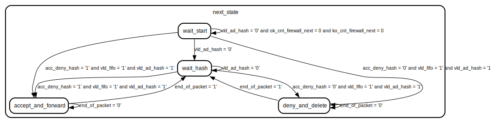

# Entity: Accept_Deny 

- **File**: accept_deny.vhd
## Diagram

## Ports

| Port name           | Direction | Type                          | Description |
| ------------------- | --------- | ----------------------------- | ----------- |
| clk                 | in        | std_logic                     |             |
| reset               | in        | std_logic                     |             |
| data_firewall       | out       | std_logic_vector(10 downto 0) |             |
| ok_cnt              | out       | std_logic_vector(7 downto 0)  |             |
| ko_cnt              | out       | std_logic_vector(7 downto 0)  |             |
| packet_forward_FIFO | in        | std_logic_vector(10 downto 0) |             |
| vld_fifo            | in        | std_logic                     |             |
| rdy_ad_FIFO         | out       | std_logic                     |             |
| acc_deny_hash       | in        | std_logic                     |             |
| vld_ad_hash         | in        | std_logic                     |             |
| rdy_ad_hash         | out       | std_logic                     |             |
| decision_ad         | in        | std_logic_vector(7 downto 0)  |             |
## Signals

| Name                 | Type                     | Description |
| -------------------- | ------------------------ | ----------- |
| current_state        | state_type               |             |
| next_state           | state_type               |             |
| ok_cnt_firewall      | integer range 0 to 200   |             |
| ko_cnt_firewall      | integer range 0 to 200   |             |
| ok_cnt_firewall_next | integer range 0 to 200   |             |
| ko_cnt_firewall_next | integer range 0 to 200   |             |
| end_of_packet        | std_logic                |             |
| first_time_cnt       | std_logic                |             |
| first_time_cnt_next  | std_logic                |             |
| rdy_ad_FIFO_next     | std_logic                |             |
| rdy_ad_FIFO_read     | std_logic                |             |
| DEBUG_decision0      | natural range 0 to 2**16 |             |
| DEBUG_decision1      | natural range 0 to 2**16 |             |
| DEBUG_decision2      | natural range 0 to 2**16 |             |
| DEBUG_decision3      | natural range 0 to 2**16 |             |
| DEBUG_decision4      | natural range 0 to 2**16 |             |
| DEBUG_decision5      | natural range 0 to 2**16 |             |
| DEBUG_decision6      | natural range 0 to 2**16 |             |
| DEBUG_decision7      | natural range 0 to 2**16 |             |
## Types

| Name       | Type                                                                                                                                                                     | Description |
| ---------- | ------------------------------------------------------------------------------------------------------------------------------------------------------------------------ | ----------- |
| state_type | (wait_hash,  accept_and_forward,  deny_and_delete,  wait_start) |             |
## Processes
- STATE_MEMORY_LOGIC: ( clk, reset )
- NEXT_STATE_LOGIC: ( current_state, vld_ad_hash, acc_deny_hash, vld_fifo, end_of_packet,
    ko_cnt_firewall_next, ok_cnt_firewall_next )
- OUTPUT_LOGIC: ( current_state, reset, vld_ad_hash, acc_deny_hash, vld_fifo, first_time_cnt, packet_forward_FIFO,
    ok_cnt_firewall, ko_cnt_firewall, rdy_ad_FIFO_read )
## State machines

