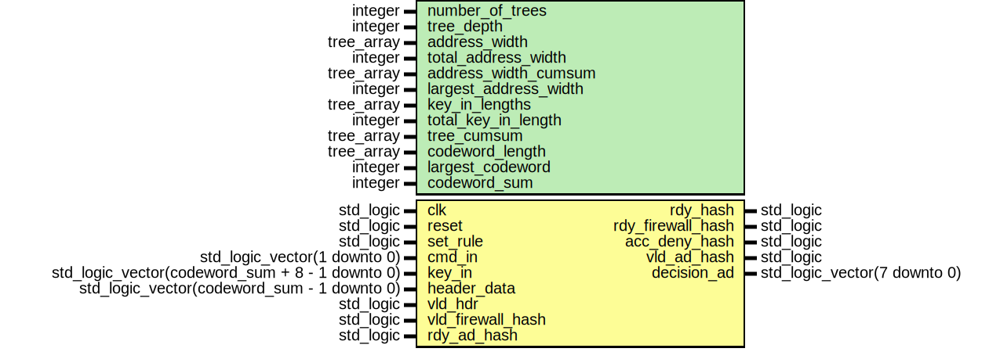

# Entity: Cuckoo_Hashing 

- **File**: cuckoo_hash.vhd
## Diagram

## Generics

| Generic name          | Type       | Value | Description |
| --------------------- | ---------- | ----- | ----------- |
| number_of_trees       | integer    |       |             |
| tree_depth            | integer    |       |             |
| address_width         | tree_array |       |             |
| total_address_width   | integer    |       |             |
| address_width_cumsum  | tree_array |       |             |
| largest_address_width | integer    |       |             |
| key_in_lengths        | tree_array |       |             |
| total_key_in_length   | integer    |       |             |
| tree_cumsum           | tree_array |       |             |
| codeword_length       | tree_array |       |             |
| largest_codeword      | integer    |       |             |
| codeword_sum          | integer    |       |             |
## Ports

| Port name         | Direction | Type                                            | Description |
| ----------------- | --------- | ----------------------------------------------- | ----------- |
| clk               | in        | std_logic                                       |             |
| reset             | in        | std_logic                                       |             |
| set_rule          | in        | std_logic                                       |             |
| cmd_in            | in        | std_logic_vector(1 downto 0)                    |             |
| key_in            | in        | std_logic_vector(codeword_sum + 8 - 1 downto 0) |             |
| header_data       | in        | std_logic_vector(codeword_sum - 1 downto 0)     |             |
| vld_hdr           | in        | std_logic                                       |             |
| rdy_hash          | out       | std_logic                                       |             |
| vld_firewall_hash | in        | std_logic                                       |             |
| rdy_firewall_hash | out       | std_logic                                       |             |
| acc_deny_hash     | out       | std_logic                                       |             |
| vld_ad_hash       | out       | std_logic                                       |             |
| rdy_ad_hash       | in        | std_logic                                       |             |
| decision_ad       | out       | std_logic_vector(7 downto 0)                    |             |
## Signals

| Name                   | Type                                                | Description |
| ---------------------- | --------------------------------------------------- | ----------- |
| current_state          | State_type                                          |             |
| next_state             | State_type                                          |             |
| exits_cuckoo           | std_logic                                           |             |
| insert_flag            | std_logic                                           |             |
| hashfun                | std_logic                                           |             |
| flip                   | std_logic                                           |             |
| flush_flag             | std_logic                                           |             |
| eq_key                 | std_logic                                           |             |
| delete_flag            | std_logic                                           |             |
| MAX                    | integer range 0 to MAX_ITER                         |             |
| exits_matching         | std_logic                                           |             |
| previous_search        | std_logic                                           |             |
| insertion_key          | std_logic_vector(codeword_sum + 8 - 1 downto 0)     |             |
| flush_cuckoo_sram      | std_logic                                           |             |
| occupied               | std_logic                                           |             |
| RW                     | std_logic                                           |             |
| address                | std_logic_vector(8 downto 0)                        |             |
| data_in                | std_logic_vector(codeword_sum + 8 - 1 downto 0)     |             |
| data_out               | std_logic_vector(codeword_sum + 8 - 1 + 1 downto 0) |             |
| flush_flag_next        | std_logic                                           |             |
| delete_flag_next       | std_logic                                           |             |
| insert_flag_next       | std_logic                                           |             |
| flush_cuckoo_SRAM_next | std_logic                                           |             |
| flip_next              | std_logic                                           |             |
| rdy_firewall_hash_next | std_logic                                           |             |
| insertion_key_next     | std_logic_vector (codeword_sum + 8 - 1 downto 0)    |             |
| MAX_next               | integer range 0 to MAX_ITER                         |             |
| eq_key_next            | std_logic                                           |             |
| occupied_next          | std_logic                                           |             |
| address_next           | std_logic_vector (8 downto 0)                       |             |
| exits_cuckoo_next      | std_logic                                           |             |
| rdy_hash_next          | std_logic                                           |             |
| previous_search_next   | std_logic                                           |             |
| vld_ad_hash_next       | std_logic                                           |             |
| exits_matching_next    | std_logic                                           |             |
| acc_deny_hash_next     | std_logic                                           |             |
| DEBUG_OK_CNT_next      | integer range 0 to 200                              |             |
| DEBUG_KO_CNT_next      | integer range 0 to 200                              |             |
| rdy_firewall_hash_read | std_logic                                           |             |
| rdy_hash_read          | std_logic                                           |             |
| vld_ad_hash_read       | std_logic                                           |             |
| acc_deny_hash_read     | std_logic                                           |             |
| DEBUG_crc0             | std_logic_vector(8 downto 0)                        |             |
| DEBUG_crc1             | std_logic_vector(8 downto 0)                        |             |
| DEBUG_BOOL             | boolean                                             |             |
| DEBUG_decision0        | natural range 0 to 2**16                            |             |
| DEBUG_decision1        | natural range 0 to 2**16                            |             |
| DEBUG_decision2        | natural range 0 to 2**16                            |             |
| DEBUG_decision3        | natural range 0 to 2**16                            |             |
| DEBUG_decision4        | natural range 0 to 2**16                            |             |
| DEBUG_decision5        | natural range 0 to 2**16                            |             |
| DEBUG_decision6        | natural range 0 to 2**16                            |             |
| DEBUG_decision7        | natural range 0 to 2**16                            |             |
| hashing_key            | std_logic_vector(codeword_sum -1 downto 0)          |             |
| decision_out           | std_logic_vector(7 downto 0)                        |             |
## Constants

| Name     | Type                         | Value       | Description |
| -------- | ---------------------------- | ----------- | ----------- |
| MAX_ITER | integer range 0 to 31        | 31          |             |
| g1       | std_logic_vector(8 downto 0) | "100101111" |             |
| g2       | std_logic_vector(8 downto 0) | "101001001" |             |
## Types

| Name       | Type                                                                                                                                                                                                                                                                                                                                                                                                                                                                                                                                                                                                                                                                                                                                                                                                                                                                                                                                                                                                             | Description |
| ---------- | ---------------------------------------------------------------------------------------------------------------------------------------------------------------------------------------------------------------------------------------------------------------------------------------------------------------------------------------------------------------------------------------------------------------------------------------------------------------------------------------------------------------------------------------------------------------------------------------------------------------------------------------------------------------------------------------------------------------------------------------------------------------------------------------------------------------------------------------------------------------------------------------------------------------------------------------------------------------------------------------------------------------- | ----------- |
| State_type | ( command_state,  flush_memory,  rdy_hash_matching,  lookup_hash1,  lookup_hash2,  insert_key,  remember_and_replace,  ERROR,  is_occupied,  rdy_key,  rdy_for_match,  search_hash1,  search_hash2,  matching,  AD_communication,  rdy_delete,  find_hashfun1,  find_hashfun2,  match_for_delete,  delete_from_memory ) |             |
## Functions
- src_hash (M : std_logic_vector;  g : std_logic_vector)  return std_logic_vector 
## Processes
- STATE_MEMORY_LOGIC: ( clk, reset )
- NEXT_STATE_LOGIC: ( current_state, insert_flag_next, set_rule, vld_firewall_hash, exits_cuckoo_next, MAX_next, flip_next, flush_flag_next,
    previous_search_next, exits_matching_next, vld_hdr, rdy_ad_hash, delete_flag_next, eq_key_next )
- OUTPUT_LOGIC: ( current_state, cmd_in, flush_flag, delete_flag, insert_flag,
  flush_cuckoo_sram, flip, rdy_firewall_hash_read, insertion_key, MAX,
  occupied, address, exits_cuckoo, rdy_hash_read, previous_search,
  vld_ad_hash_read, exits_matching, acc_deny_hash_read,
  eq_key, data_out, header_data, key_in )
- unnamed: ( vld_ad_hash_next )
## Instantiations

- cuckoo_SRAM_inst: cuckoo_SRAM
## State machines

