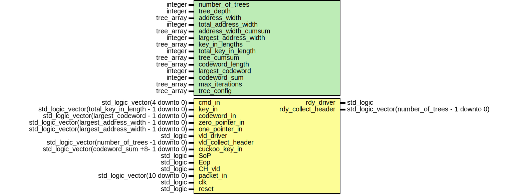

# Entity: system_blueprint 

- **File**: system_blueprint.vhd
## Diagram

## Generics

| Generic name          | Type       | Value       | Description |
| --------------------- | ---------- | ----------- | ----------- |
| number_of_trees       | integer    |             |             |
| tree_depth            | integer    |             |             |
| address_width         | tree_array |             |             |
| total_address_width   | integer    |             |             |
| address_width_cumsum  | tree_array |             |             |
| largest_address_width | integer    |             |             |
| key_in_lengths        | tree_array |             |             |
| total_key_in_length   | integer    |             |             |
| tree_cumsum           | tree_array |             |             |
| codeword_length       | tree_array |             |             |
| largest_codeword      | integer    |             |             |
| codeword_sum          | integer    |             |             |
| max_iterations        | tree_array | (1,1,1,1,1) |             |
| tree_config           | tree_array | (1,1,1,1,1) |             |
## Ports

| Port name          | Direction | Type                                                 | Description |
| ------------------ | --------- | ---------------------------------------------------- | ----------- |
| cmd_in             | in        | std_logic_vector(4 downto 0)                         |             |
| key_in             | in        | std_logic_vector(total_key_in_length - 1 downto 0)   |             |
| codeword_in        | in        | std_logic_vector(largest_codeword - 1 downto 0)      |             |
| zero_pointer_in    | in        | std_logic_vector(largest_address_width - 1 downto 0) |             |
| one_pointer_in     | in        | std_logic_vector(largest_address_width - 1 downto 0) |             |
| rdy_driver         | out       | std_logic                                            |             |
| vld_driver         | in        | std_logic                                            |             |
| rdy_collect_header | out       | std_logic_vector(number_of_trees - 1 downto 0)       |             |
| vld_collect_header | in        | std_logic_vector(number_of_trees -1 downto 0)        |             |
| cuckoo_key_in      | in        | std_logic_vector(codeword_sum +8- 1 downto 0)        |             |
| SoP                | in        | std_logic                                            |             |
| Eop                | in        | std_logic                                            |             |
| CH_vld             | in        | std_logic                                            |             |
| packet_in          | in        | std_logic_vector(10 downto 0)                        |             |
| clk                | in        | std_logic                                            |             |
| reset              | in        | std_logic                                            |             |
## Signals

| Name                                      | Type                                                              | Description |
| ----------------------------------------- | ----------------------------------------------------------------- | ----------- |
| fileinput                                 | std_logic_vector(size downto 0)                                   |             |
| vld_firewall                              | std_logic                                                         |             |
| rdy_FIFO                                  | std_logic                                                         |             |
| rdy_collecthdr                            | std_logic                                                         |             |
| vld_hdr_FIFO                              | std_logic                                                         |             |
| hdr_SoP                                   | std_logic                                                         |             |
| hdr_EoP                                   | std_logic                                                         |             |
| packet_forward                            | std_logic_vector(10 downto 0)                                     |             |
| ip_version                                | std_logic_vector(3 downto 0)                                      |             |
| ip_header_len                             | std_logic_vector(3 downto 0)                                      |             |
| ip_TOS                                    | std_logic_vector (7 downto 0)                                     |             |
| ip_total_len                              | std_logic_vector(15 downto 0)                                     |             |
| ip_ID                                     | std_logic_vector(15 downto 0)                                     |             |
| ip_flags                                  | std_logic_vector(2 downto 0)                                      |             |
| ip_fragmt_offst                           | std_logic_vector(12 downto 0)                                     |             |
| ip_ttl                                    | std_logic_vector(7 downto 0)                                      |             |
| ip_protocol                               | std_logic_vector(7 downto 0)                                      |             |
| ip_checksum                               | std_logic_vector(15 downto 0)                                     |             |
| ip_src_addr                               | std_logic_vector(31 downto 0)                                     |             |
| ip_dest_addr                              | std_logic_vector(31 downto 0)                                     |             |
| src_port                                  | std_logic_vector(15 downto 0)                                     |             |
| dest_port                                 | std_logic_vector(15 downto 0)                                     |             |
| tcp_seq_num                               | std_logic_vector(31 downto 0)                                     |             |
| tcp_ack_num                               | std_logic_vector(31 downto 0)                                     |             |
| tcp_data_offset                           | std_logic_vector(3 downto 0)                                      |             |
| tcp_reserved                              | std_logic_vector(2 downto 0)                                      |             |
| tcp_flags                                 | std_logic_vector(8 downto 0)                                      |             |
| tcp_window_size                           | std_logic_vector(15 downto 0)                                     |             |
| L4checksum                                | std_logic_vector(15 downto 0)                                     |             |
| tcp_urgent_ptr                            | std_logic_vector(15 downto 0)                                     |             |
| udp_len                                   | std_logic_vector(15 downto 0)                                     |             |
| collect_header_key_out_to_tree_collection | std_logic_vector(103 downto 0)                                    |             |
| vld_collect_header_wire                   | std_logic_vector(4 downto 0)                                      |             |
| rdy_collect_header_wire                   | std_logic_vector(4 downto 0)                                      |             |
| set_rule                                  | std_logic                                                         |             |
| header_data                               | std_logic_vector(codeword_sum - 1 downto 0)                       |             |
| vld_hdr                                   | std_logic                                                         |             |
| rdy_hash                                  | std_logic                                                         |             |
| vld_firewall_hash                         | std_logic                                                         |             |
| rdy_firewall_hash                         | std_logic                                                         |             |
| acc_deny_hash                             | std_logic                                                         |             |
| vld_ad_hash                               | std_logic                                                         |             |
| rdy_ad_hash                               | std_logic                                                         |             |
| address                                   | std_logic_vector(largest_address_width - 1 downto 0)              |             |
| RW                                        | std_logic_vector(number_of_trees - 1 downto 0)                    |             |
| codeword_out                              | std_logic_vector(largest_codeword  - 1 downto 0)                  |             |
| zero_pointer_out                          | std_logic_vector(largest_address_width - 1 downto 0)              |             |
| one_pointer_out                           | std_logic_vector(largest_address_width - 1 downto 0)              |             |
| codeword_to_concat                        | std_logic_vector(largest_codeword * number_of_trees - 1 downto 0) |             |
| cuckoo_codeword                           | std_logic_vector(largest_codeword * number_of_trees - 1 downto 0) |             |
| cuckoo_select                             | std_logic                                                         |             |
| cuckoo_cmd                                | std_logic_vector(1 downto 0)                                      |             |
| cuckoo_key_out                            | std_logic_vector(codeword_sum + 8- 1 downto 0)                    |             |
| rule_cuckoo_rdy                           | std_logic                                                         |             |
| rule_cuckoo_vld                           | std_logic                                                         |             |
| decision_ad                               | std_logic_vector(7 downto 0)                                      |             |
| trees_to_cuckoo_hash_vld                  | std_logic                                                         |             |
| trees_to_cuckoo_hash_rdy                  | std_logic                                                         |             |
| data_firewall                             | std_logic_vector(10 downto 0)                                     |             |
| ok_cnt                                    | std_logic_vector(7 downto 0)                                      |             |
| ko_cnt                                    | std_logic_vector(7 downto 0)                                      |             |
| packet_forward_FIFO                       | std_logic_vector(10 downto 0)                                     |             |
| vld_fifo                                  | std_logic                                                         |             |
| rdy_ad_FIFO                               | std_logic                                                         |             |
| data                                      | STD_LOGIC_VECTOR (10 DOWNTO 0)                                    |             |
| rdreq                                     | STD_LOGIC                                                         |             |
| wrreq                                     | STD_LOGIC                                                         |             |
| empty                                     | STD_LOGIC                                                         |             |
| full                                      | STD_LOGIC                                                         |             |
| q                                         | STD_LOGIC_VECTOR (10 DOWNTO 0)                                    |             |
| usedw                                     | STD_LOGIC_VECTOR (7 DOWNTO 0)                                     |             |
## Constants

| Name | Type    | Value | Description |
| ---- | ------- | ----- | ----------- |
| size | integer | 10000 |             |
## Instantiations

- rule_engine_inst: rule_engine
- tree_collection_inst: tree_collection
- Cuckoo_Hashing_inst: Cuckoo_Hashing
- Collect_header_inst: Collect_header
- Accept_Deny_inst: Accept_Deny
- packet_fifo_inst: packet_fifo
