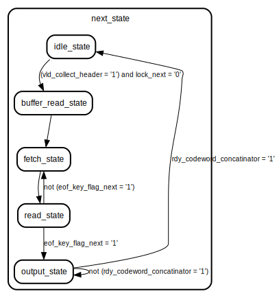

# Entity: trie_tree_logic 

- **File**: trie_tree.vhd
## Diagram

## Generics

| Generic name    | Type    | Value | Description |
| --------------- | ------- | ----- | ----------- |
| key_length      | integer | 16    |             |
| address_width   | integer | 8     |             |
| codeword_length | integer | 16    |             |
| max_iterations  | integer | 1     |             |
| address_offset  | integer | 4     |             |
| ismiddle        | boolean | false |             |
| islast          | boolean | false |             |
## Ports

| Port name                 | Direction | Type                                                               | Description |
| ------------------------- | --------- | ------------------------------------------------------------------ | ----------- |
| key_in                    | in        | std_logic_vector(key_length - 1 downto  0)                         |             |
| codeword                  | out       | std_logic_vector(codeword_length - 1 downto 0)                     |             |
| address                   | out       | std_logic_vector(address_width - 1 downto 0)                       |             |
| data_from_memory          | in        | std_logic_vector(codeword_length + address_width * 2 - 1 downto 0) |             |
| RW                        | in        | std_logic                                                          |             |
| rdy_collect_header        | out       | std_logic                                                          |             |
| vld_collect_header        | in        | std_logic                                                          |             |
| rdy_codeword_concatinator | in        | std_logic                                                          |             |
| vld_codeword_concatinator | out       | std_logic                                                          |             |
| input_address             | in        | std_logic_vector(address_width - 1 downto 0)                       |             |
| output_address            | out       | std_logic_vector(address_width - 1 downto 0)                       |             |
| input_codeword            | in        | std_logic_vector(codeword_length - 1 downto 0)                     |             |
| key_out                   | out       | std_logic_vector(key_length - 1 downto 0)                          |             |
| key_cnt_out               | out       | std_logic_vector(4 downto 0 )                                      |             |
| key_cnt_in                | in        | std_logic_vector(4 downto 0)                                       |             |
| clk                       | in        | std_logic                                                          |             |
| reset                     | in        | std_logic                                                          |             |
## Signals

| Name                | Type                                          | Description |
| ------------------- | --------------------------------------------- | ----------- |
| current_state       | State_type                                    |             |
| next_state          | State_type                                    |             |
| eof_key_flag        | std_logic                                     |             |
| eof_key_flag_next   | std_logic                                     |             |
| key_cnt             | natural range 0 to key_length - 1             |             |
| zeros               | std_logic_vector(address_width - 1 downto 0)  |             |
| codeword_zeros      | std_logic_vector(codeword_length -1 downto 0) |             |
| best_codeword       | std_logic_vector(codeword_length -1 downto 0) |             |
| final_codeword      | std_logic_vector(codeword_length -1 downto 0) |             |
| DEBUG_bool          | boolean                                       |             |
| DEBUG_bool_max_iter | boolean                                       |             |
| DEBUG_bool_00       | std_logic                                     |             |
| DEBUG_bool_01       | std_logic                                     |             |
| DEBUG_bool_02       | std_logic                                     |             |
| debug_key_in        | std_logic                                     |             |
| lock                | std_logic                                     |             |
| lock_next           | std_logic                                     |             |
| output_codeword     | std_logic_vector(codeword_length -1 downto 0) |             |
| key_reg             | std_logic_vector(key_length - 1 downto 0)     |             |
| address_reg         | std_logic_vector(address_width - 1 downto 0)  |             |
| reg                 | std_logic                                     |             |
| reg_next            | std_logic                                     |             |
## Types

| Name       | Type                                                                                                                                                                                                                    | Description |
| ---------- | ----------------------------------------------------------------------------------------------------------------------------------------------------------------------------------------------------------------------- | ----------- |
| State_type | ( idle_state,  buffer_read_state,  output_state,  read_state,  fetch_state) |             |
## Processes
- STATE_MEMORY_LOGIC: ( clk, reset, RW )
- NEXT_STATE_LOGIC: ( current_state, vld_collect_header, rdy_codeword_concatinator, eof_key_flag_next,lock, reg )
- OUTPUT_LOGIC: ( current_state, data_from_memory, eof_key_flag, key_cnt_in, input_address, key_in )
## State machines

