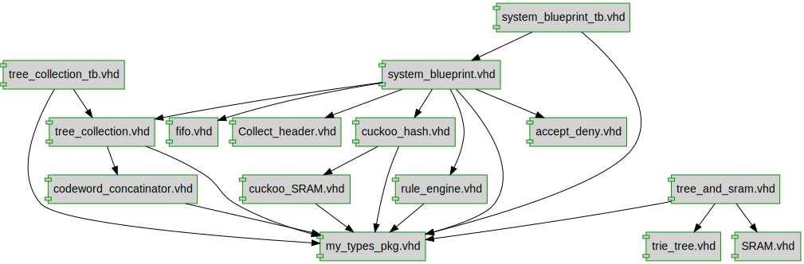

# Documentation for: diagram

Generated by **TerosHDL** © 2020-2021 License GPLv3 Carlos Alberto Ruiz Naranjo (carlosruiznaranjo@gmail.com) Ismael Perez Rojo (ismaelprojo@gmail.com)  Project revision 2023-06-11 14:16:40  

## Designs

- Package: [my_types_pkg ](./doc_internal/my_types_pkg.md)
- Module: [codeword_concatinator ](./doc_internal/codeword_concatinator.md)
- Module: [SRAM ](./doc_internal/SRAM.md)
- Module: [tree_and_sram ](./doc_internal/tree_and_sram.md)
- Module: [tree_collection ](./doc_internal/tree_collection.md)
- Module: [trie_tree_logic ](./doc_internal/trie_tree.md)
- Module: [system_blueprint ](./doc_internal/system_blueprint.md)
- Module: [Accept_Deny ](./doc_internal/accept_deny.md)
- Module: [packet_fifo ](./doc_internal/fifo.md)
- Module: [Collect_header ](./doc_internal/Collect_header.md)
- Module: [Cuckoo_Hashing ](./doc_internal/cuckoo_hash.md)
- Module: [cuckoo_SRAM ](./doc_internal/cuckoo_SRAM.md)
- Module: [rule_engine ](./doc_internal/rule_engine.md)

